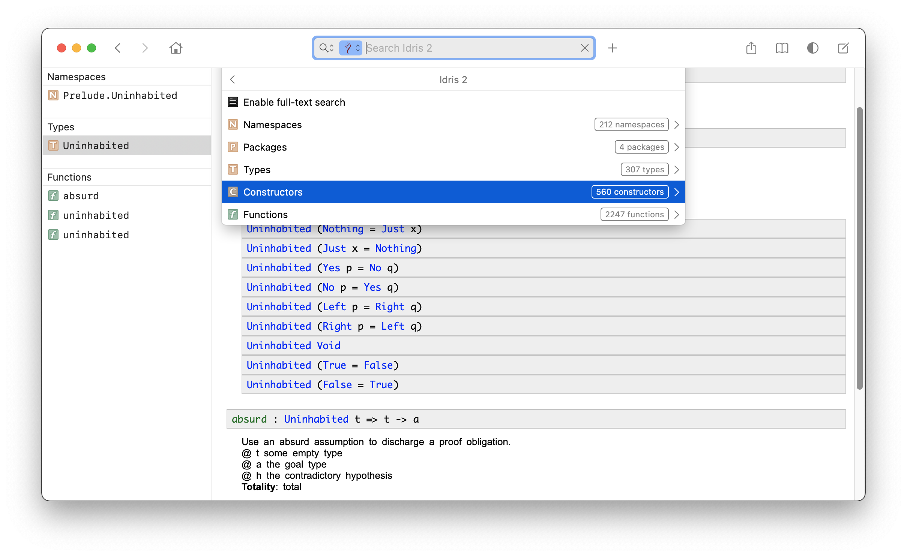

# Dash docset for Idris 2

## Building locally

- Install [Dashing](https://github.com/technosophos/dashing#install)
- Checkout [Idris 2](https://github.com/idris-lang/Idris2) to `../Idris2`
- Build the Idris2 library docs with

    $ cd ../Idris2 && make libdocs

- Finally, make `idris2.docset` via `make`

    $ make
